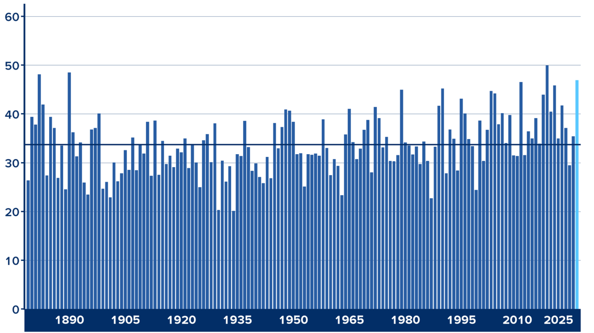
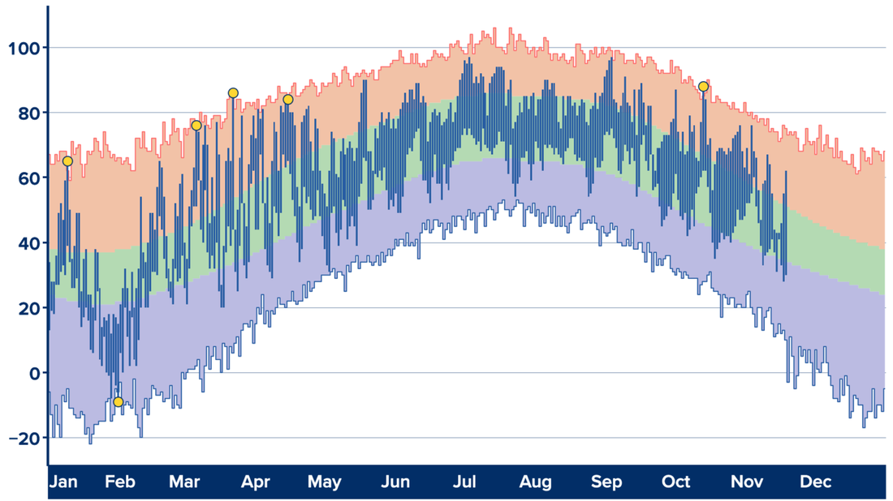
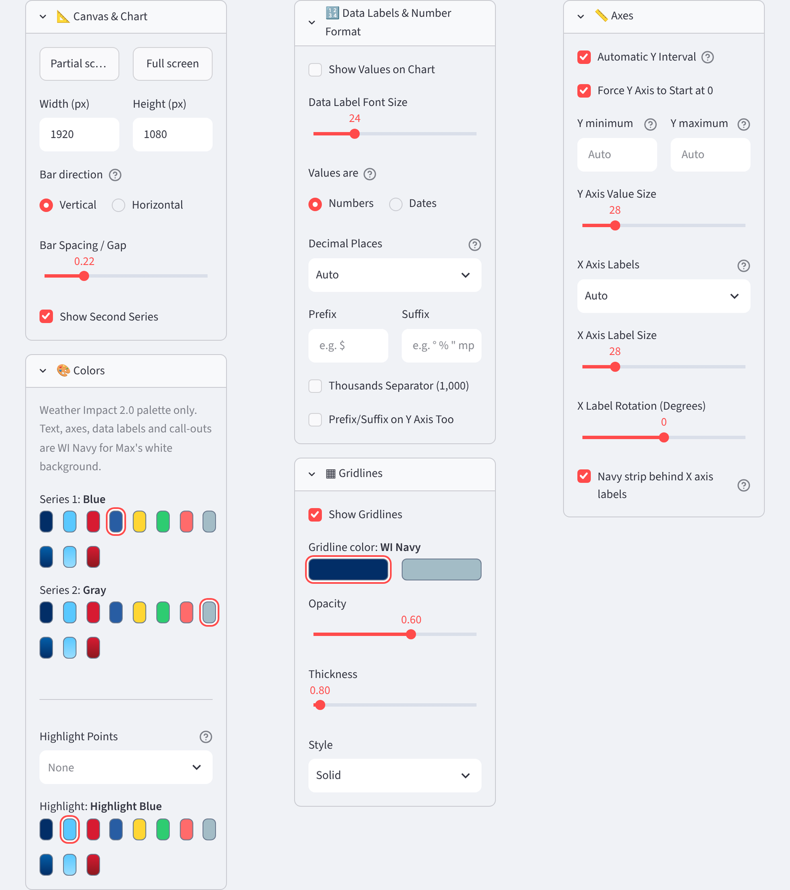

<!--
  Help text for the Graph Maker tab (public page and configurator).
  Normal Markdown. Screenshots live in content/images/ and are written as .
  Change the app's address in content/apps.json, not here.
-->
## Graph Maker

Graph Maker builds chart graphics for on-air weather segments and exports them as transparent PNGs you drop into Max. You can type or paste your own numbers, or pull a station's full daily history from ACIS, the official NWS source (the data behind xmACIS), and let the app work out records, normals and rankings for you.

*Year Ranking selected: choose a state, station, variable and period, then click Use this station data.*

### What it can do

- **Your own data.** Type into the table, paste cells straight from Excel or Google Sheets (xmACIS and NOWData work too), or import a CSV or Excel file. The first column is the labels, the next one or two columns are the numbers.
- **Bar and line charts** with one or two series, highlighted points and optional data labels. Bars can run vertically or horizontally, which suits sorted top-10 lists and named rows. See "Chart controls" below for every setting.
- **Four climate presets** (marked with a star) that pull a station's daily record from ACIS:
    - **Running Total:** season-to-date rain or snow against normal, with the range of all years and the highest and lowest years. Pick when the season starts (snow seasons usually start Jul 1, water years Oct 1, or a meteorological season) and whether to show the normal for the rest of the season.
    - **Climo Band:** each day's highs and lows over the record-high band, the normal range and the record-low band, for a full year, a month, a date range or a single year, with new records marked.
    - **Year Ranking:** every year on record, by year or sorted, with one year highlighted and ranked ("5th wettest of 133 years"), an average line and an optional trend line. Years missing more than a set number of days are left out.
    - **Range Bars:** floating bars from a start to an end, such as the growing season for every year (the last spring and first fall low at or below 32 degrees by default; use 28 for a hard freeze).
- **Import from an IEM autoplot.** Paste the address of a plot made at mesonet.agron.iastate.edu/plotting/auto, then pick which of its columns go into the chart. Not every autoplot offers its data.
- **Number formatting.** Decimal places, prefixes and suffixes such as a degree sign or percent, and thousands separators.
- **Look.** Canvas size, text sizes, colors, gridlines, axis range and label rotation. Colors come from the Weather Impact 2.0 palette, picked by clicking color chips.
- **Projects.** Save your data and settings as a JSON file and load it again later.
- **No titles or legends.** Those are added in Max.

### How to use it

1. Open the app (button at the top of this tab).
2. Pick a **Chart Type** across the top.
3. Get your data in. Either fill the table, paste, or import; or, for a starred preset, choose a **State** and **Station**, set that preset's options (for Year Ranking a **Variable** and **Period**; Running Total a **Season starts**; Climo Band a **Period**), and click **Use this station data**. "Area" stations are a city's long-term threaded record.
4. Adjust the look in the sidebar: canvas size, preset options such as the highlighted year, colors, data labels, axes and gridlines. The chart updates as you go.
5. Download the chart as a transparent PNG and place it in Max.
6. To keep working later, save the project file and load it next time.

*Year Ranking: every year's year-to-date precipitation at the Columbus Area station, the latest year in light blue and the average as a navy line.*

*Running Total: this year (thick light blue) against the range of every year (tan), the highest and lowest years (thin lines) and the normal (dashed).*

*Climo Band: this year's daily highs and lows (blue) over the record-high (warm), normal (green) and record-low (cool) bands, with new records marked in yellow.*

### Chart controls

Everything below is in the sidebar on the left, in sections you can open and close. These apply to every chart type; the starred presets add a **Preset Options** section at the top for their own settings (highlighted year, band style, bar or line style and so on). The chart redraws as you change things.

*The sidebar sections, shown with a second series turned on.*

**Canvas & Chart**
- **Width and Height** in pixels. The default is 1920 x 1080 (full-screen HD); match whatever your Max graphic needs.
- **Bar charts:** **Bar direction** is vertical or horizontal (horizontal suits named rows such as rankings, cities or event types). **Bar Spacing / Gap** sets how much space is between bars, from 0 (touching) to 0.9 (thin bars).
- **Line charts:** **Line Thickness**, **Point Size** and **Marker Style** (the shape at each point: circle, square, triangle or diamond).
- **Show Second Series** adds a second column of values, drawn next to the first bar or as a second line. Use it to compare, such as this year against last.

**Colors**
- Colors come only from the Weather Impact 2.0 palette: WI Navy, Highlight Blue, Breaking Red, Blue, Yellow, Green, Coral and Gray, plus a few darker and lighter shades. Click a chip to pick it; the name of the chosen color is shown above the chips. There is no free color picker, so every graphic stays on brand.
- Each series has its own color (**Series 1**, **Series 2**).
- **Highlight Points** picks which points of Series 1 are drawn in the highlight color, so you can call out one bar or day (for example today, or the record year). Choose Select All, or just the individual points you want, then choose the highlight color just below it.
- Text, axis lines, data labels and call-outs are always WI Navy, because Max's background is white.

**Fonts and text size**
- There is one font, set by the app, so there is no font menu. You control **size** instead: **Data Label Font Size** (the numbers on the chart), **Y Axis Value Size** and **X Axis Label Size**.
- **X Label Rotation** tilts the bottom labels (-90 to 90 degrees) when they crowd. **X Axis Labels** chooses which bars get a label; if labels collide, pick a wider spacing, a smaller size or rotate them. A highlighted bar always keeps its label.
- **Navy strip behind X axis labels** (on by default) puts white labels on a WI Navy strip under the chart, as on Weather Impact bar graphics. Turn it off and the labels are navy on a transparent background instead.

**Data Labels & Number Format**
- **Show Values on Chart** prints each value on its bar or point. **Label position** is past the end of the bar or inside it (bar charts).
- **Values are** Numbers or Dates. Dates (for example a last-frost date per year) show as "Oct 18"; this is picked automatically when you paste or import dates.
- **Decimal Places:** Auto (up to 3 decimals, dropping trailing zeros), or exactly 0, 1, 2 or 3.
- **Prefix and Suffix** add symbols such as $, a degree sign, % or " (inches). **Thousands Separator** shows 1,000 instead of 1000. **Prefix/Suffix on Y Axis Too** repeats them on the value axis.

**Axes**
- **Automatic Y Interval** picks a round step with about 10 or fewer gridlines. Turn it off to set the interval yourself.
- **Force Y Axis to Start at 0** keeps bars honest. Turn it off for a line that should zoom in on the range.
- **Y minimum / Y maximum** fix the ends of the value axis, such as 0 to 100 for a percent, so graphics compare fairly from one to the next. Leave them blank for automatic.

**Gridlines**
- **Show Gridlines** turns them on or off. Set the **color** (white, WI Navy or gray), **Opacity**, **Thickness** and **Style** (solid, dashed or dotted; solid by default).

### Where the numbers come from

- **Station data** comes from ACIS, the official NWS source, so records, normals and rankings use the same observations as xmACIS and NOWData. Each station shows the dates its daily data covers.
- **Normals** can be NCEI's official 1991-2020 normals (the default, the ones the NWS daily climate report uses) or averages over the station's full record. IEM's own plot (#113) uses full-record averages, so pick **Full record** if you want to match it.
- **Your own numbers** can still be pasted or imported from xmACIS, NOWData or any other source. The table accepts T (trace) and M (missing).
- **Dates as values** (for example the last spring freeze per year, as `16-Oct` or `2025-10-16`) are read as dates, shown as "Oct 16", ranked as latest or earliest, and any trend line is labeled in days per decade.
- The app runs on Streamlit Community Cloud, which puts idle apps to sleep. If you see a "wake up" message, click it and allow about 30 seconds, and open the app before you need it on air.
